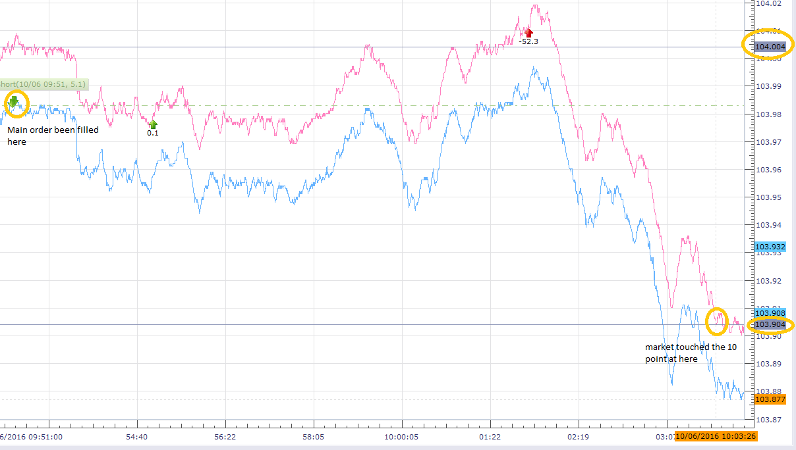
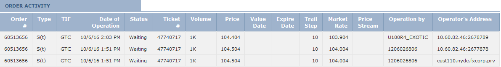

## Trailing stop peg order

### How to set stop peg orders
	First You need to set ELS order, then in stop order please set stop price on tag99 and fluctuate point at tag9061.

	9061=1 == dynamic
	9061=from 2 to 9 is invalid (you will get error “Traling step did not pass validation.” )
	9061=10+ == fixed
	
### How does peg worked	

	ELS order with main order sell 1K USD/JPY market FOK + stop order at 99=104.504 with fluctuate point 9061=10 and limit order. Please be aware that this ELS has three orders bind together. Each order should has its own CLOrdID In this case, the stop order is 11=1475761911686 11=1475761911686|67=1|583=2|1=1206026806|55=USD/JPY|54=1|60=20161006-13:51:51.682|38=1000|40=3|99=104.504|9061=10|

	Main order been filled immediately at market. At the same time market rate of ask been set to tag 31=104.004 (this is not trigger price but you can think this is trigger reference, you can get this value in market price message 35=W) and stop price at 104.504 at tag 99 11=1475761911686|14=0|15=USD|17=111400333|31=104.004|32=0|37=60513656|38=1000|39=0|40=P|44=104.504|54=1|55=USD/JPY|59=1

	When market moved to 103.904 which is 10 points from this reference 104.004, both market price and stop price been moved 10 point. And becomes as tag31=103.904 and tag44=104.404 You will see the stop price change on TSII GUI also. Then it wait the market to touch 10 point off 103.904 which is 103.804 11=1475761911686|14=0|15=USD|17=111402690|31=103.904|32=0|37=60513656|38=1000|39=0|40=P|44=104.404|54=1|55=USD/JPY|59=1|
	

	DEBUG (2016-10-06 09:51:51,696) [QF/J Session dispatcher: FIX.4.4:FXCM/RAPID->1206026806_client1] (app) - <<< app message from counterparty: 8=FIX.4.4|9=430|35=E|34=5|49=1206026806_client1|52=20161006-13:51:51.682|56=FXCM|57=RAPID|66=1475761911669|68=3|1385=101|73=3|
	11=1475761911685|67=0|583=1|1=1206026806|55=USD/JPY|54=2|60=20161006-13:51:51.682|38=1000|40=1|59=4|
	11=1475761911686|67=1|583=2|1=1206026806|55=USD/JPY|54=1|60=20161006-13:51:51.682|38=1000|40=3|99=104.504|9061=10|
	11=1475761911687|67=2|583=2|1=1206026806|55=USD/JPY|54=1|60=20161006-13:51:51.682|38=1000|40=2|44=103.504|10=087|
	DEBUG (2016-10-06 09:51:51,702) [0:Bus:1206026806_client1FXCMRAPID] (app) - >>> app message to counterparty: 8=FIX.4.4|9=518|35=8|34=14|49=FXCM|50=RAPID|52=20161006-13:51:51.702|56=1206026806_client1|1=1206026806|6=104.504|11=1475761911686|14=0|15=USD|17=111400333|31=104.004|32=0|37=60513656|38=1000|39=0|40=P|44=104.504|54=1|55=USD/JPY|59=1|60=20161006-13:51:51|66=1475761911669|99=0|150=0|151=1000|198=60513655|211=104.504|336=FXCM|625=RAPID|835=0|836=0|1094=0|1385=101|9000=2|9041=47740717|9050=ST|9051=W|9061=10|9079=60513655|453=1|448=FXCM ID|447=D|452=3|802=4|523=6026806|803=10|523=1206026806|803=2|523=API - Test|803=22|523=32|803=26|10=105|
	DEBUG (2016-10-06 09:51:51,826) [0:Bus:1206026806_client1FXCMRAPID] (app) - >>> app message to counterparty: 8=FIX.4.4|9=505|35=8|34=19|49=FXCM|50=RAPID|52=20161006-13:51:51.826|56=1206026806_client1|1=1206026806|6=104.504|11=1475761911686|14=0|15=USD|17=111400508|31=104.004|32=0|37=60513656|38=1000|39=0|40=P|44=104.504|54=1|55=USD/JPY|59=1|60=20161006-13:51:51|66=1475761911669|99=0|150=0|151=1000|211=104.504|336=FXCM|625=RAPID|835=0|836=0|1094=0|1385=101|9000=2|9041=47740717|9050=ST|9051=W|9061=10|9079=60513655|453=1|448=FXCM ID|447=D|452=3|802=4|523=6026806|803=10|523=1206026806|803=2|523=API - Test|803=22|523=32|803=26|10=246|
	DEBUG (2016-10-06 10:03:26,724) [0:Bus:1206026806_client1FXCMRAPID] (app) - >>> app message to counterparty: 8=FIX.4.4|9=505|35=8|34=33|49=FXCM|50=RAPID|52=20161006-14:03:26.724|56=1206026806_client1|1=1206026806|6=104.404|11=1475761911686|14=0|15=USD|17=111402690|31=103.904|32=0|37=60513656|38=1000|39=0|40=P|44=104.404|54=1|55=USD/JPY|59=1|60=20161006-14:03:26|66=1475761911669|99=0|150=0|151=1000|211=104.404|336=FXCM|625=RAPID|835=0|836=0|1094=0|1385=101|9000=2|9041=47740717|9050=ST|9051=W|9061=10|9079=60513655|453=1|448=FXCM ID|447=D|452=3|802=4|523=6026806|803=10|523=1206026806|803=2|523=API - Test|803=22|523=32|803=26|10=248|

	** Dynamic peg example: 9061=1 **
	8=FIX.4.4|9=515|35=E|34=6|49=1206026806_client1|52=20161007-14:53:41.963|56=FXCM|57=RAPID|66=FIX.4.4:1206026806_client1->FXCM/RAPID-14758520217125|68=3|1385=101|73=3|11=FIX.4.4:1206026806_client1->FXCM/RAPID-1475852021962-6|67=0|583=1|1=1206026806|55=EUR/USD|54=2|38=10000|40=1|11=FIX.4.4:1206026806_client1->FXCM/RAPID-1475852021962-7|67=1|583=2|1=1206026806|55=EUR/USD|54=1|38=10000|40=3|99=1.12401|9061=1|11=FIX.4.4:1206026806_client1->FXCM/RAPID-1475852021963-8|67=2|583=2|1=1206026806|55=EUR/USD|54=1|38=10000|40=2|44=1.11725|10=228|

	** Peg been triggered, price in tag 44 is in dynamic **
	DEBUG (2016-10-07 10:53:41,821) [0:Bus:1206026806_client1FXCMRAPID] (app) - >>> app message to counterparty: 8=FIX.4.4|9=600|35=8|34=69|49=FXCM|50=RAPID|52=20161007-14:53:41.821|56=1206026806_client1|1=1206026806|6=1.12401|11=FIX.4.4:1206026806_client1->FXCM/RAPID-1475852021962-7|14=0|15=EUR|17=111563733|31=1.11922|32=0|37=60576267|38=10000|39=0|40=P|44=1.12401|54=1|55=EUR/USD|59=1|60=20161007-14:53:41|66=FIX.4.4:1206026806_client1->FXCM/RAPID-14758520217125|99=0|150=0|151=10000|198=60576266|211=1.12401|336=FXCM|625=RAPID|835=0|836=0|1094=0|1385=101|9000=1|9041=47788992|9050=ST|9051=W|9061=1|9079=60576266|453=1|448=FXCM ID|447=D|452=3|802=4|523=6026806|803=10|523=1206026806|803=2|523=API - Test|803=22|523=32|803=26|10=244|
	DEBUG (2016-10-07 10:53:41,959) [0:Bus:1206026806_client1FXCMRAPID] (app) - >>> app message to counterparty: 8=FIX.4.4|9=587|35=8|34=75|49=FXCM|50=RAPID|52=20161007-14:53:41.959|56=1206026806_client1|1=1206026806|6=1.12401|11=FIX.4.4:1206026806_client1->FXCM/RAPID-1475852021962-7|14=0|15=EUR|17=111563912|31=1.11922|32=0|37=60576267|38=10000|39=0|40=P|44=1.12401|54=1|55=EUR/USD|59=1|60=20161007-14:53:41|66=FIX.4.4:1206026806_client1->FXCM/RAPID-14758520217125|99=0|150=0|151=10000|211=1.12401|336=FXCM|625=RAPID|835=0|836=0|1094=0|1385=101|9000=1|9041=47788992|9050=ST|9051=W|9061=1|9079=60576266|453=1|448=FXCM ID|447=D|452=3|802=4|523=6026806|803=10|523=1206026806|803=2|523=API - Test|803=22|523=32|803=26|10=132|
	DEBUG (2016-10-07 10:53:42,060) [0:Bus:1206026806_client1FXCMRAPID] (app) - >>> app message to counterparty: 8=FIX.4.4|9=581|35=8|34=77|49=FXCM|50=RAPID|52=20161007-14:53:42.060|56=1206026806_client1|1=1206026806|6=1.124|11=FIX.4.4:1206026806_client1->FXCM/RAPID-1475852021962-7|14=0|15=EUR|17=111563914|31=1.11921|32=0|37=60576267|38=10000|39=0|40=P|44=1.124|54=1|55=EUR/USD|59=1|60=20161007-14:53:42|66=FIX.4.4:1206026806_client1->FXCM/RAPID-14758520217125|99=0|150=0|151=10000|211=1.124|336=FXCM|625=RAPID|835=0|836=0|1094=0|1385=101|9000=1|9041=47788992|9050=ST|9051=W|9061=1|9079=60576266|453=1|448=FXCM ID|447=D|452=3|802=4|523=6026806|803=10|523=1206026806|803=2|523=API - Test|803=22|523=32|803=26|10=079|
	DEBUG (2016-10-07 10:53:42,571) [0:Bus:1206026806_client1FXCMRAPID] (app) - >>> app message to counterparty: 8=FIX.4.4|9=587|35=8|34=78|49=FXCM|50=RAPID|52=20161007-14:53:42.571|56=1206026806_client1|1=1206026806|6=1.12396|11=FIX.4.4:1206026806_client1->FXCM/RAPID-1475852021962-7|14=0|15=EUR|17=111563915|31=1.11917|32=0|37=60576267|38=10000|39=0|40=P|44=1.12396|54=1|55=EUR/USD|59=1|60=20161007-14:53:42|66=FIX.4.4:1206026806_client1->FXCM/RAPID-14758520217125|99=0|150=0|151=10000|211=1.12396|336=FXCM|625=RAPID|835=0|836=0|1094=0|1385=101|9000=1|9041=47788992|9050=ST|9051=W|9061=1|9079=60576266|453=1|448=FXCM ID|447=D|452=3|802=4|523=6026806|803=10|523=1206026806|803=2|523=API - Test|803=22|523=32|803=26|10=173|
	DEBUG (2016-10-07 10:53:43,131) [0:Bus:1206026806_client1FXCMRAPID] (app) - >>> app message to counterparty: 8=FIX.4.4|9=587|35=8|34=79|49=FXCM|50=RAPID|52=20161007-14:53:43.131|56=1206026806_client1|1=1206026806|6=1.12393|11=FIX.4.4:1206026806_client1->FXCM/RAPID-1475852021962-7|14=0|15=EUR|17=111563916|31=1.11914|32=0|37=60576267|38=10000|39=0|40=P|44=1.12393|54=1|55=EUR/USD|59=1|60=20161007-14:53:43|66=FIX.4.4:1206026806_client1->FXCM/RAPID-14758520217125|99=0|150=0|151=10000|211=1.12393|336=FXCM|625=RAPID|835=0|836=0|1094=0|1385=101|9000=1|9041=47788992|9050=ST|9051=W|9061=1|9079=60576266|453=1|448=FXCM ID|447=D|452=3|802=4|523=6026806|803=10|523=1206026806|803=2|523=API - Test|803=22|523=32|803=26|10=157|
	…..

	** Invalid peg example: **
	8=FIX.4.4|9=515|35=E|34=6|49=1206026806_client1|52=20161007-16:06:30.401|56=FXCM|57=RAPID|66=FIX.4.4:1206026806_client1->FXCM/RAPID-14758563901965|68=3|1385=101|73=3|
	11=FIX.4.4:1206026806_client1->FXCM/RAPID-1475856390400-6|67=0|583=1|1=1206026806|55=EUR/USD|54=2|38=10000|40=1|
	11=FIX.4.4:1206026806_client1->FXCM/RAPID-1475856390401-7|67=1|583=2|1=1206026806|55=EUR/USD|54=1|38=10000|40=3|99=1.12019|9061=2|
	11=FIX.4.4:1206026806_client1->FXCM/RAPID-1475856390401-8|67=2|583=2|1=1206026806|55=EUR/USD|54=1|38=10000|40=2|44=1.11344|10=236|
	8=FIX.4.4|9=557|35=8|34=7|49=FXCM|50=RAPID|52=20161007-16:06:30.470|56=1206026806_client1|1=1206026806|6=1.11524|11=FIX.4.4:1206026806_client1->FXCM/RAPID-1475856390400-6|14=0|15=EUR|17=111586686|31=1.11524|32=0|37=60582259|38=10000|39=0|40=1|44=1.11524|54=2|55=EUR/USD|59=1|60=20161007-16:06:30|66=FIX.4.4:1206026806_client1->FXCM/RAPID-14758563901965|99=0|150=0|151=10000|211=0|336=FXCM|625=RAPID|835=0|836=0|1094=0|9000=1|9041=47793540|9050=OM|9051=P|9061=0|453=1|448=FXCM ID|447=D|452=3|802=4|523=6026806|803=10|523=1206026806|803=2|523=API - Test|803=22|523=32|803=26|10=156|
	8=FIX.4.4|9=646|35=8|34=8|49=FXCM|50=RAPID|52=20161007-16:06:30.471|56=1206026806_client1|1=1206026806|6=1.12019|11=FIX.4.4:1206026806_client1->FXCM/RAPID-1475856390401-7|14=0|15=EUR|17=0|31=0|32=0|37=NONE|38=10000|39=8|40=3|44=1.12019|54=1|55=EUR/USD|58=19915;DAS 19915: ZDas Exception ORA-20115: Traling step did not pass validation.|59=1|60=20161007-16:06:30|66=FIX.4.4:1206026806_client1->FXCM/RAPID-14758563901965|99=1.12019|103=99|150=8|151=0|211=0|336=FXCM|625=RAPID|835=0|836=0|1094=0|9000=1|9025=0|9029=19915;DAS 19915: ZDas Exception ORA-20115: Traling step did not pass validation.|9051=R|9061=0|453=1|448=FXCM ID|447=D|452=3|802=1|523=6026806|803=10|10=153|

	** Fixed peg example: **
	8=FIX.4.4|9=516|35=E|34=6|49=1206026806_client1|52=20161007-13:44:16.267|56=FXCM|57=RAPID|66=FIX.4.4:1206026806_client1->FXCM/RAPID-14758478560675|68=3|1385=101|73=3|
	11=FIX.4.4:1206026806_client1->FXCM/RAPID-1475847856266-6|67=0|583=1|1=1206026806|55=EUR/USD|54=2|38=10000|40=1|
	11=FIX.4.4:1206026806_client1->FXCM/RAPID-1475847856267-7|67=1|583=2|1=1206026806|55=EUR/USD|54=1|38=10000|40=3|99=1.12382|9061=10|
	11=FIX.4.4:1206026806_client1->FXCM/RAPID-1475847856267-8|67=2|583=2|1=1206026806|55=EUR/USD|54=1|38=10000|40=2|44=1.11708|10=103|